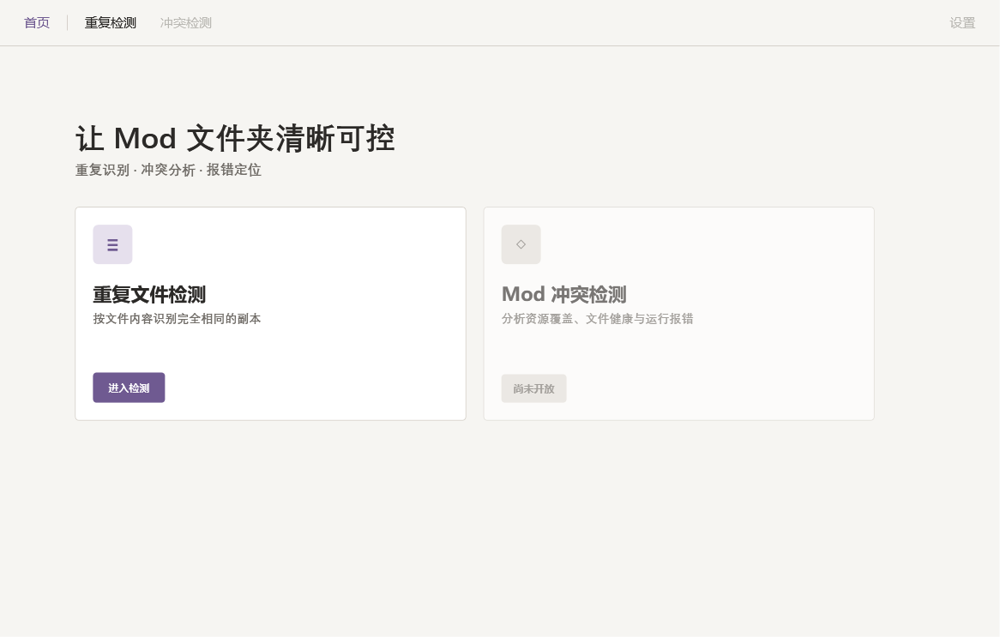
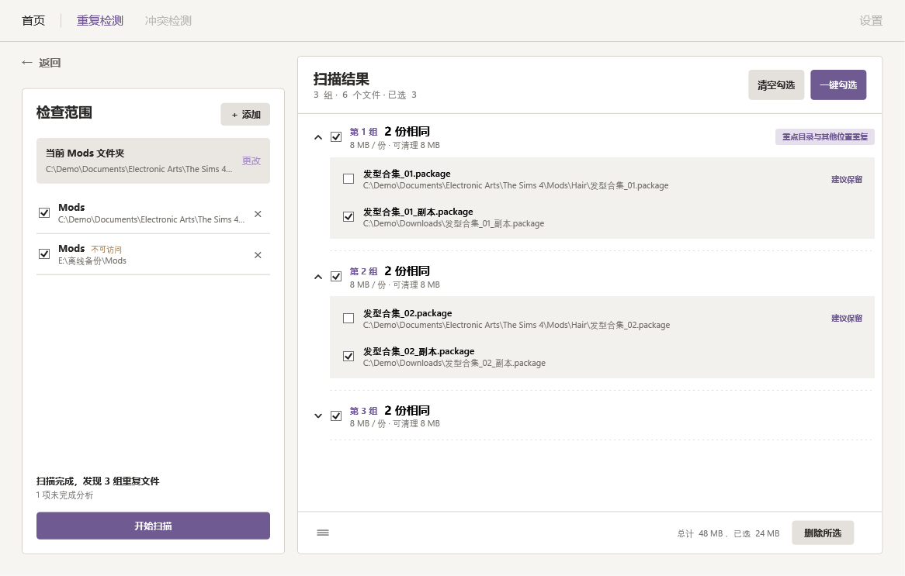

# Sims 4 Mod Sieve · UI 设计风格规范 v1

版本日期：2026-10-09  
用途：为后续冲突检测及其他页面提供可复用的视觉、组件和交互基线。  
用户已确认：沿用当前风格，发现的问题单独作为改进建议，不进行整体改版。

本文中的「现状」来自现有 WPF 代码与离屏渲染；「沿用规则」用于保持后续页面一致；「建议」尚未实施，不表示已获准修改现有页面。

## 1. 范围与核验方式

检查范围包括首页、重复检测页的范围区、Mods 卡片、来源行、空结果、展开/收起结果、扫描中状态、底部操作栏，以及删除确认窗。冲突检测和设置在现有桌面界面中仍是禁用入口，尚无可作为基线的实际页面。底层能力完成与桌面入口开放是两件事。

视觉来源：

- [App.xaml](../../src/Sims4ModSieve.Desktop/App.xaml)：颜色、字体、按钮、卡片、展开组件及品牌图形资源。
- [MainWindow.xaml](../../src/Sims4ModSieve.Desktop/MainWindow.xaml)：页面结构、尺寸、局部样式与绑定。
- [DeleteConfirmationWindow.xaml](../../src/Sims4ModSieve.Desktop/DeleteConfirmationWindow.xaml)：紧凑确认窗。
- [MainWindowViewModel.cs](../../src/Sims4ModSieve.Desktop/ViewModels/MainWindowViewModel.cs)、[DuplicateResultSession.cs](../../src/Sims4ModSieve.Desktop/ViewModels/DuplicateResultSession.cs)：状态、选择及结果会话。
- [AGENTS.md](../../AGENTS.md)：此前已确认的视觉尺度、操作语义及局部改动边界。

截图用虚构路径和样例数据离屏渲染，覆盖默认窗口 1180×780 与最小窗口 920×640，只含内容区、不含系统标题栏。未验证不同 DPI、键盘导航和系统主题。

## 2. 整体气质

**克制、温暖、清楚，有工具感。**

页面用暖灰底、白色卡片和低饱和紫色构成层次。留白承担分区，细边框承担边界，标题和数据通过字体与字重区分。主要动作明确，辅助动作轻量。

沿用规则：

- 大面积背景保持暖色调；白色用于卡片内部。
- 紫色用于主要动作、当前导航和少量信息强调，不代表危险。
- 卡片与按钮以小圆角为主，不改成胶囊、大圆角或悬浮玻璃效果。
- 不引入大面积渐变、装饰阴影、无关插画或高饱和状态面板。
- 首页可以舒展；工作页优先承载文件信息，保持紧凑可扫读。
- 局部更改不自动升级为全局风格调整。

## 3. 页面结构与响应方式

### 3.1 外框与导航

| 项目 | 当前值 / 规则 |
|---|---|
| 默认窗口 | 1180×780 DIP |
| 最小窗口 | 920×640 DIP |
| 应用内导航高度 | 54 DIP，位于原生窗口标题栏下方 |
| 导航水平边距 | 28 DIP |
| 导航下边线 | 1 DIP，`BorderBrush` |
| 导航文字 | Microsoft YaHei UI，15，Normal |
| 当前导航 | 紫色文字；无填充胶囊、无大色块 |
| 右侧入口 | 设置，当前禁用 |

首页、重复检测、未来冲突检测共用这一条导航。页面切换不改变导航的高度、位置和字体。

### 3.2 首页

- 内容上边距 90、下边距 40。
- 水平布局比例为 `0.75* : 8* : 1.25*`，主内容占约 80%，并非严格居中，右侧留白更宽。
- 展示标题「让 Mod 文件夹清晰可控」使用 35 号等线 Bold。
- 副标题使用 16 号等线 SemiBold，暖灰色；上距 10，下距 34。
- 两张功能卡片等宽，间距 20；卡片内边距 20。
- 卡片高度为自身宽度的 `0.547`，最低 246。
- 卡片内部图标、说明、动作三个区域按 `0.32 : 0.49 : 0.19` 分配空间。
- 图标容器 46×46、圆角 6；功能标题 22，说明 14、行高 22。
- 冲突检测卡片当前整体透明度 0.62，标注「尚未开放」。这属于未开放状态，不是未来可用卡片的固定外观。

窗口变宽时，内容和卡片舒展；字体、图标和按钮字号不随整页同比放大。不要用整页 Viewbox 代替响应布局。



### 3.3 工作页

```text
┌──────────────── 顶部导航 ───────────────────┐
│ 返回            ┌──────── 结果标题与工具 ───┐│
│ ┌─ 范围卡片 ──┐ │                           ││
│ │ 范围 / 添加 │ │ 分组结果                   ││
│ │ 当前 Mods   │ │   展开资源 / 文件明细       ││
│ │ 来源列表    │ │                           ││
│ │             │ │ 结果区内部滚动             ││
│ │ 状态 / 进度 │ ├───────────────────────────┤│
│ │ 扫描 / 取消 │ │ 底部统计与操作             ││
│ └─────────────┘ └───────────────────────────┘│
└─────────────────────────────────────────────┘
```

- 外边距：左 28、上 18、右 28、下 28。
- 两列比例约 31:69，中间间距 16；左列最低宽度 300，因此窄窗口下不严格保持比例。
- 「返回」位于左列上方，下方留出 24 DIP 行间距；左卡片顶部低于右卡片。这是当前布局事实，不应误改成强制齐顶。
- 左侧只管理范围、来源和扫描状态；右侧承载结果阅读及文件动作。
- 左卡片内边距 18；右卡片外层内边距 0，由各区域独立设定。
- 右侧标题区内边距 `20,17`，下边线 1；底栏内边距 `20,11,36,11`，上边线 1。
- 来源列表与结果列表各自滚动。结果列表不显示水平滚动条，较长路径省略并提供 Tooltip。
- 保留结果列表虚拟化与 Recycling；不要换成一次渲染全部大数据的长 StackPanel。



## 4. 颜色规范

| 角色 | 颜色 | 现有资源 / 使用方式 |
|---|---|---|
| 页面底色 | `#F6F5F2` | `WindowBrush` |
| 卡片表面 | `#FFFFFF` | `SurfaceBrush` |
| 主文字 | `#2B2927` | `InkBrush` |
| 次要文字、路径 | `#706C67` | `MutedBrush` |
| 主要强调紫 | `#6F5A91` | `AccentBrush` |
| 浅紫底 | `#E6E0ED` | `AccentSoftBrush`，标签、首页图标底 |
| 通用细边框 | `#D5D0CA` | `BorderBrush` |
| 主按钮悬停 | `#624D89` | `PrimaryButtonStyle` 触发器 |
| 次按钮底 / 悬停 | `#E4E0DB` / `#DAD5CF` | `SecondaryButtonStyle` |
| Ghost 按钮悬停底 | `#E2DED8` | `GhostButtonStyle` |
| 当前 Mods 区 | `#EAE7E2` | 页面局部值 |
| 展开文件区 | `#F3F1ED` | 页面局部值 |
| 轻量路径操作 | `#A892C5` | 「选择 / 更改」文字，用户明确指定 |
| 不可访问提示 | `#9A6A32` | 来源、Mods 根目录的提示文字 |
| 分组虚线 | `#D8D3CC` | 1 DIP，透明度 0.78，虚线数组 `2,4` |

颜色的语义应保持稳定。新增页面优先复用资源；确需把已有局部色提取为资源时，保持视觉值不变。表中的局部值不代表当前已有同名全局 Token。

淡紫色的「选择 / 更改」是辅助操作，不应被扩大成正文色、主要按钮色或错误提示色。不要因重用按钮模板而把它重新加粗或放大。

## 5. 字体与信息层级

字号单位为 WPF DIP，不是印刷 pt。

| 角色 | 字体 / 字重 | 当前典型字号 |
|---|---|---|
| 品牌资源 | Bahnschrift SemiBold，回退 Microsoft YaHei UI / SemiBold | 由使用位置决定 |
| 首页展示标题 | 等线 / Bold | 35 |
| 首页功能卡标题 | Microsoft YaHei UI / SemiBold | 22 |
| 工作区标题 | Microsoft YaHei UI / SemiBold | 18 |
| 组标题 | Microsoft YaHei UI / SemiBold | 15 |
| 导航 | Microsoft YaHei UI / Normal | 15 |
| 首页副标题 / 说明 | 等线 / SemiBold | 16 / 14 |
| 数据、路径、统计 | Segoe UI Variable Text，回退等线 / Normal | 10–12，路径通常 11 |
| 文件名 | 同数据字体 / SemiBold | 继承控件字号，当前未单独显式指定 |
| 当前 Mods 标题 | Microsoft YaHei UI / SemiBold | 12 |
| 「选择 / 更改」 | 继承界面字体 / Normal | 12 |
| 小标签 / 建议保留 | 当前字体 / SemiBold | 10 |
| 删除确认正文 | Microsoft YaHei UI / Normal | 14 |

`BodyTextStyle` 当前是等线 SemiBold，并不是 Normal；不要凭样式名字推断字重。部分按钮及文本沿用默认字号，后续显式提取字号时先核对渲染，避免隐性变大。

`BrandTextStyle` 与紫色晶锥 `BrandMarkImage` 已存在于资源中，但当前首页正文没有展示品牌字标。不要因资源存在，就自行新增一块品牌横幅。

层级靠字号、字重、颜色和位置共同建立。同一行不要让组编号、标题、路径、标签全部粗重；文件名高于路径，组标题高于文件名，统计弱于标题。

## 6. 组件规范

### 卡片与分隔

- `CardStyle`：白底、1 DIP 暖灰边框、圆角 4、默认内边距 20，无阴影。
- 展开文件区：暖灰底 `#F3F1ED`；当前是平直嵌套区域，不追加独立卡片边框。
- 来源行用细实线分隔；结果组用轻虚线分隔。两者不混用。
- 小标签圆角 3、内边距 `9,4`，浅紫底、紫色字；避免做成大型状态横幅。

### 按钮

| 类型 | 当前样式 | 用法与尺寸 |
|---|---|---|
| 主动作 | `PrimaryButtonStyle` | 紫底白字，圆角 4，默认 Padding `18,10`，SemiBold |
| 次动作 | `SecondaryButtonStyle` | 暖灰底深字；「添加」「清空勾选」「取消扫描」「删除所选」 |
| 轻量操作 | `HeaderBackButtonStyle` | 无底色、灰字；「返回」及局部操作的基类 |
| 顶部导航 | `HeaderNavButtonStyle` | 透明底、Normal；悬停紫字 |
| 当前导航 | `ActiveHeaderNavButtonStyle` | 紫色文字 |
| 裸图标 | `BareIconButtonStyle` | 灰色图标，悬停紫色；矩形热区承担命中 |

局部规格：

- 添加 / 清空勾选 / 一键勾选：Padding `12,7`。
- 删除所选：Padding `16,8`，当前沿用次按钮；不要默认改成红色主按钮。
- 扫描：左卡片底部横向填满可用宽度；运行中同位置显示次按钮「取消扫描」。
- Mods 选择 / 更改：12 号、Normal、`#A892C5`，Padding `6,2`，与路径区垂直居中；不得恢复为大号粗体。
- 主按钮禁用透明度 0.45；导航禁用使用 MutedBrush 并叠加 0.45；裸图标禁用 0.4。不要擅自把这些不同控件全部统一成另一个数值。

### 来源与路径

- 来源行由复选框、名称和路径、移除按钮构成；内边距 `2,11`。
- 名称突出，路径弱化；完整路径保留在 Tooltip。
- 不可访问是独立运行时状态，用 10 号暖棕色文字表达。保留用户原来的勾选意图，不自动取消勾选。
- 来源移除按钮当前为「×」，18 号，Padding `7,2`。
- Mods 根目录卡片与扫描来源列表是两个语义不同的区域，不合并为同一个勾选项。

### 结果组与文件行

- 组头包括展开箭头、组级复选框、组编号、主标题、弱化统计和可选范围标签。
- 当前展开箭头单独占 20 DIP 列，图形约 10×6，线宽 1.8；不要把整行点击误绑定成组选择。
- 展开区外边距 `20,3,0,7`，内边距 `8,4`；文件行边距 `8,9`。
- 文件行使用复选框、文件名、完整路径、建议保留提示。建议保留项展示在组内前面，保留策略来自 Core。
- 「建议保留」用紫色文字标识，不以整行绿色背景强化。
- ListBox 自定义容器不显示系统整行蓝色选中底，操作选择由明确的复选框表达。

### 图标与命中区域

- 后续新增图标优先用轻量矢量 Path / DrawingImage，保持线条和视觉重量一致。
- 全部展开 / 收起为三条手风琴线，通过线距区分状态。图标 16×16、线宽 1.35、圆端点，按钮热区 24×24。
- 图标层不承担独立命中：内容 `IsHitTestVisible=false`，完整矩形宿主负责点击。
- 裸按钮宿主背景与表面同色，视觉无底色而热区完整。
- 首页「≡」「◇」、来源「×」和返回箭头是现存字符图标，不将其扩展成新增功能的通用图标体系。

### 删除确认与错误反馈

删除确认已明确批准为紧凑形式：窗口 320×142、不可调整大小、居中于父窗口、无标题文字、不单列任务栏入口。正文只有「确定删除所选文件？」；右侧依次「否」「是」，按钮各 40×28、间距 8、12 号 Normal。

不要往该确认窗重新加入数量、大小、完整路径、回收站说明、撤回说明或整组警告。后台仍执行文件复核；失败时另行说明。

意外错误目前使用系统 MessageBox；文件操作失败也用系统警告窗口，最多展示前 8 项并提示其余数量。这是现状，不应在文档中虚构成已实现的自定义 Toast 或统一紫色弹窗。

## 7. 文字与状态表达

用短语表达动作，用一行主状态加一行弱化细节表达过程。按钮通常不加句号；避免把页面标题、按钮动作和说明重复写三遍。技术标识放在详情中，不占据主要任务文案。

| 场景 | 当前行为 / 后续沿用要点 |
|---|---|
| 首次进入重复检测 | 展示来源，结果中央「尚未扫描」 |
| 开始扫描 | 新建结果会话、清除旧结果，来源编辑与主要文件操作锁定 |
| 扫描进行中 | 左底部进度、状态、取消；已知总量用确定进度，否则不确定进度 |
| 扫描完成有结果 | 右侧分组列表和底栏；左侧完成摘要及未完成分析数量 |
| 扫描完成无结果 | 左侧说明未发现重复；右侧现有空态仍写「尚未扫描」，见改进建议 |
| 取消 / 失败 | 左侧分别显示「扫描已取消」「扫描没有完成」；不能包装成完整成功 |
| 来源离线 | 保留路径和勾选，显示「不可访问」；进入页面、开始扫描前刷新可用性 |
| 删除完成 / 部分失败 | 底部轻量提示；失败信息单独报告；有可撤回操作时显示「撤回」 |

已批准的结果会话联动：新增来源、移除部分来源、启停来源，保留旧结果；全部来源移除，清空结果、选择、状态与撤回记录；开始新扫描建立新会话。返回首页再进入不应自行清空结果。

组级勾选继承既有规则：按建议删除集合选中，或手动选中整组全部文件，组复选框都可显示选中。不要在视觉重构中改变其业务语义。

路径可以省略显示，但文件行的完整路径必须包含文件名，并可通过 Tooltip 查看。不要把被截断的显示文本当作实际文件身份。

## 8. 后续冲突检测页面如何沿用

以下是基于本规范的扩展建议，供实现前的页面方案使用，并非已存在的界面。

- 沿用顶部导航、左右工作区、范围卡片、Mods 轻量操作、状态区和分组结果容器。
- 将右侧标题和工具替换成冲突分析所需动作。可以加入轻量筛选，但不重新设计另一套巨型仪表盘。
- 以资源组为第一层、内容相同的子组为第二层、文件为明细。TGI 作为可复制的技术细节，不要求玩家先理解编号才能阅读结论。
- 结果文本使用「内容相同」「内容不同」「比较不完整」。部分资源无法比较，但已有两种哈希时，要同时表达「内容不同」和「比较不完整」。
- 先依靠文字和既有标签区分状态。可延用紫色强调信息、暖棕色提示未完成；不要给内容差异自动加红色危险语义。
- 「内容不同」不写成「有害冲突」「导致报错」或「必须删除」。不从资源覆盖差异推导加载顺序和保留建议。
- 路径操作优先使用定位文件、复制路径等辅助动作；重复检测的勾选删除、可清理大小与撤回栏不能机械复制到冲突结果。
- 文件已变化、超出限制、压缩方式不支持等放在相关失败项下，摘要简短、详情可展开。
- 首页冲突卡片开放时移除禁用表现，替换「尚未开放」；介绍文字只写已经上线的子功能。

## 9. 发现的问题与改进建议

本节不改变现有基线，不自动授权界面修改。后续实现相关页面时可一并评估。

| 现状 / 证据 | 建议 |
|---|---|
| 默认系统进度条在本次渲染中为绿色，未设置品牌色模板 | 后续统一到紫色体系，保留确定 / 不确定进度两种状态 |
| 右侧空态仅绑定 HasNoResults，扫描中、取消后、零结果完成仍可能显示「尚未扫描」 | 按真实阶段区分初始、扫描中、无结果、取消和失败；继承当前简短文案尺度 |
| BareIconButton 与展开 ToggleButton 取消了 FocusVisualStyle | 在不改变常态视觉的前提下补键盘焦点提示与可访问名称，验证 Tab/Space/Enter |
| 10–11 号路径和标签较密，淡紫色辅助文字对比偏弱 | 先测 125% / 150% DPI 与长路径；用户已指定的「更改」样式保持原值，调整前再确认 |
| 移除来源按钮、复选框、滚动条和错误框仍部分依赖系统样式 | 跨 Windows 主题验证，不把本次机器的原生外观写成品牌 Token |
| 首页冲突卡片包含尚未开放的能力描述 | 开放入口时只写已上线的子功能 |

## 10. 实现与验收清单

实现时优先复用 App.xaml 中的已有 Style。新增同类组件只增加必要差异；相似模板修改必须定位准确的 `x:Key`。

- 默认 1180×780、最小 920×640 均可用；长路径和多个标签不挤出主动作。
- 建议覆盖 100%、125%、150% DPI；窗口伸缩改变布局，不整体缩放文字。
- 检查初始、扫描中、取消、失败、完成有结果、完成无结果、部分无法比较等状态。
- 顶部导航、左底部扫描动作和右底部工具保持稳定；长列表在内容区滚动。
- 逐项验证 Tooltip、展开 / 收起、禁用态、键盘焦点与图标热区。
- 保留虚拟化；大量结果验收时同时检查滚动体验。
- 修改点击热区后运行 `BareIconButtonHitTests`；WPF 测试在 STA 环境执行。
- `Run.Text` 绑定只读 ViewModel 属性时显式使用 `Mode=OneWay`。
- UI 改动应构建通过、运行相关测试并实际启动检查；仅编译成功不等于可见效果验证完成。
- 不在界面事件里重写 Core 的判断规则，不通过新增状态布尔值绕开既有会话生命周期。

## 11. 视觉附件

截图均为现有 XAML 加虚构数据的离屏渲染。文字和样例路径用于布局核验，不是玩家真实扫描记录。确认窗截图仅含客户区，原生无文字标题栏需结合 XAML 规格理解。

- [01 首页](./assets/ui-baseline-2026-10-09/01-home.png)
- [02 初始空结果与离线来源](./assets/ui-baseline-2026-10-09/02-scanner-empty.png)
- [03 展开结果与底栏](./assets/ui-baseline-2026-10-09/03-scanner-results.png)
- [04 最小窗口结果页](./assets/ui-baseline-2026-10-09/04-scanner-minimum.png)
- [05 扫描中状态](./assets/ui-baseline-2026-10-09/05-scanner-busy.png)
- [06 删除确认客户区](./assets/ui-baseline-2026-10-09/06-delete-confirmation.png)
